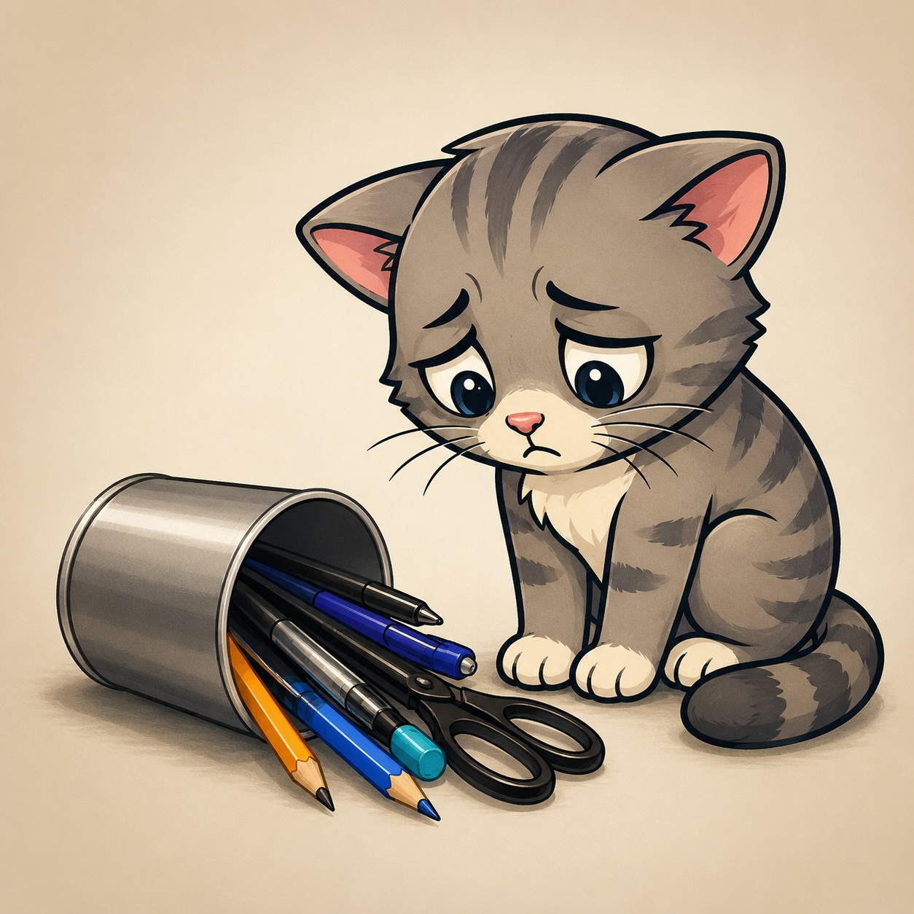

# guiltty



A Rust library for drawing real, pixel-level 2D graphics in the terminal, using the
[Kitty Graphics Protocol](https://sw.kovidgoyal.net/kitty/graphics-protocol/) as its first
backend.

## Why

Currently, TUI toolkits such as [`ratatui`](https://github.com/ratatui/ratatui) and
[`cursive`](https://github.com/gyscos/cursive) can't display real images, smooth shapes, or
pixel-precise positioning because they're fundamentally built around a grid of character cells.

The _Kitty Graphics Protocol_, however, can render actual pixels in compatible terminals. A few
projects have explored building graphical UIs on top of it (for example,
[`kui.nvim`](https://github.com/romgrk/kui.nvim)), but the ecosystem remains small and the
results have generally been experimental.

`guiltty` aims to provide that same capability — drawable canvases, shapes, sprites, and
viewports — as a standalone, host-independent Rust library, rather than tying it to a single
host application. It does not aim to provide interactive UI controls (buttons, clickable
widgets) or event handling — see [`docs/spec.md`](docs/spec.md)'s Boundaries for what's
explicitly out of scope.

## Status: early scaffold, pre-alpha

This project is still in its early stages of development, but its ambitions are considerable.

Its goals include:

- [x] Creating canvases. **[DONE]**
- [x] Drawing text and vector shapes. **[DONE]**
- [x] Placing and animating sprites over preserved backgrounds. **[DONE]**
- [x] Encoding and transmitting frames via the kitty graphics protocol. **[DONE]**
- [ ] Confirming live rendering against a real kitty-compatible terminal. **[IN PROGRESS]**<br/>
      Code-complete but unverified: no kitty-compatible terminal has been available in this environment.<br/>
      See [`docs/spec-kitty-e2e.md`](docs/spec-kitty-e2e.md) for the planned automated + manual verification work.
- [ ] Carving a terminal into multiple independent viewports. **[NOT STARTED]**<br/>
      Deferred pending a design pass (`docs/design/viewport-regions-zoom-scroll.md`, not yet written).
- [ ] Zooming and panning across large canvases. **[NOT STARTED]**<br/>
      Same reason as above.

What exists today:

- A three-crate Cargo workspace (`guiltty-core`, `guiltty-kitty`, `guiltty`) matching the
  architecture described in [`docs/spec.md`](docs/spec.md).
- `guiltty-core`: the `Color` (RGBA8), `Point`, and `Rect` primitives; the backend-agnostic
  `Backend` trait that rendering backends implement; and a `Canvas` supporting text, shape
  drawing (lines, rectangles, circles, ellipses, triangles, and arbitrary paths), and movable
  `Sprite`s over a preserved background — all implemented and unit-tested.
- `guiltty-kitty`: a `KittyBackend` implementing `Backend` — encodes and transmits a `Canvas`'s
  pixel buffer as a real kitty graphics protocol escape sequence (built on the
  [`kittage`](https://github.com/itsjunetime/kittage) crate), covered by protocol-level tests.
  Not yet confirmed against a real terminal — see the goals checklist above.
- `guiltty`: a facade crate re-exporting the above.
- A runnable example (`examples/src/bin/demo.rs`) exercising canvas/text/shapes/sprites and two
  rendered frames, for manual visual verification once a kitty-compatible terminal is available.

**Still missing:** independent viewport regions, zoom, and scroll/pan for canvases larger than
the terminal (see the goals checklist above). See [`docs/spec.md`](docs/spec.md)'s Success
Criteria for the full v0 scope, and
[`docs/intent/kitty-graphics-ui-toolkit.md`](docs/intent/kitty-graphics-ui-toolkit.md) for the
confirmed project intent this spec implements.

This is a solo project (author + AI coding agents) with no fixed deadline.

## Building

```
cargo build --workspace
cargo test --workspace
cargo clippy --workspace --all-targets -- -D warnings
cargo fmt --all -- --check
```

Rust toolchain is pinned via [mise](https://mise.jdx.dev/) (see `mise.toml`).

## License

MIT — see [`LICENSE`](LICENSE).
